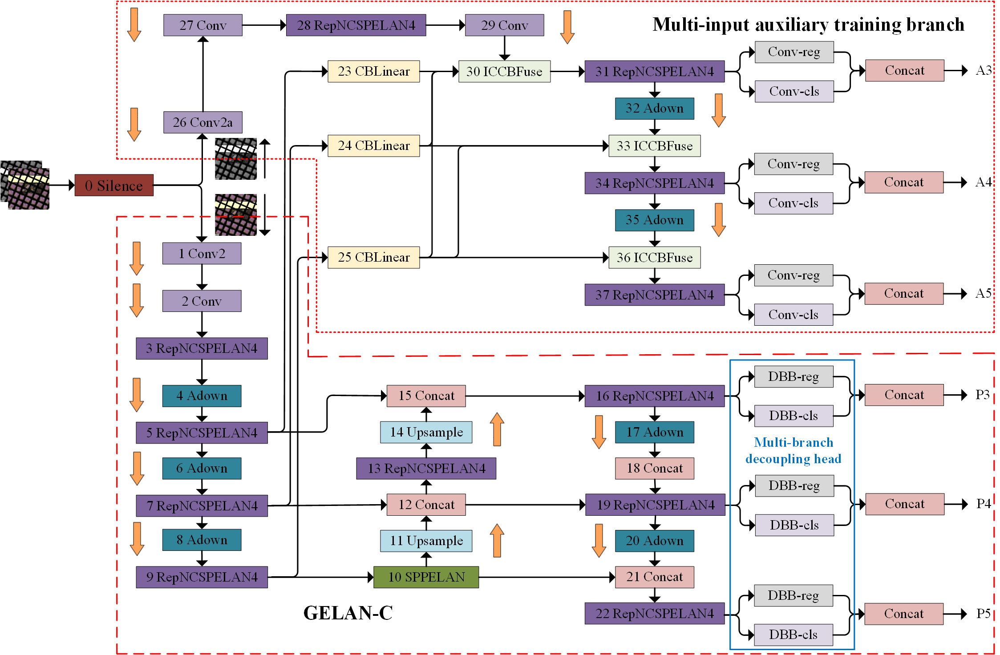

# multi-input-auxiliary-branch-training
基于多输入辅助分支训练的太阳能网版表面缺陷检测

# 介绍
针对现有的太阳能网版表面缺陷中存在目标小、部分类别缺陷训练样本不足以及目标长宽比失衡等问题，本文提出了一种多输入隐式自主学习的辅助分支来辅助训练的太阳能网版缺陷检测模型。该模型在GELAN-C模型基础上引入了多输入辅助训练分支，并减小辅助分支的深度，以减小图像信息损失和信息瓶颈的影响，并利用灰度图输入增加低语义信息。在辅助分支融合阶段，引入一个具备自主学习隐藏相关性的模块(ImplicitConvCBFuse, ICCBFuse)，以增强对输入特征图的理解能力，并提升对小目标检测能力。此外，本文还提出一种多分支解耦头接头，其中使用(Diverse Branch Block， DBB)模块替换GELAN-C检测头中卷积操作，该解耦头能够提取不同分支尺度的层次特征，并将多尺度语义信息进行凝聚。在推理阶段通过重参数化将DBB模块变化为普通卷积，从而在不增加推理计算成本前提下提升了目标类别数量较少的难训练样本精度。为解决目标长宽比失衡的类别样本问题，本文采用了ShapeIoU损失函数取代传统的CIoU损失函数，以提升对长宽比失衡的类别样本检测能力。实验结果表明，该模型在保持原有参数量、计算量和检测速度的同时，实现了更高的检测精度，能够快速、准确地太阳能网版表面缺陷进行检测。

# 网络结构
